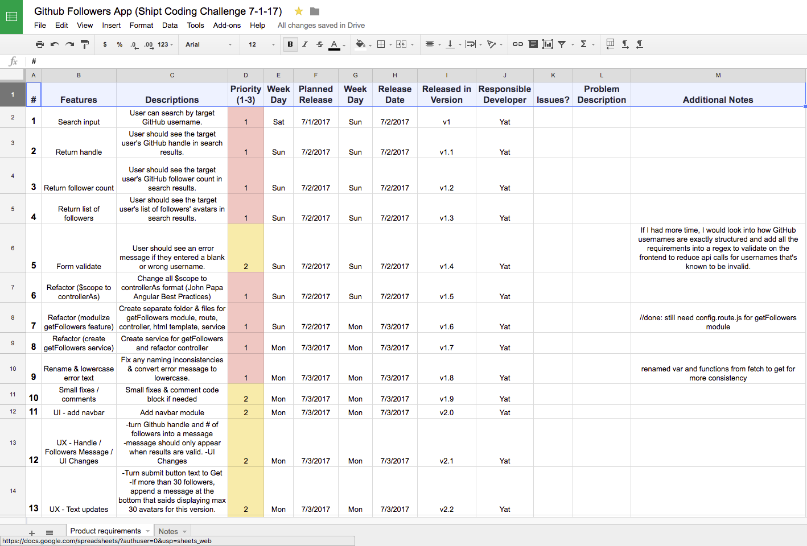

# GitHub Followers
A simple app to help you find followers of other GitHub users. 

# Live Demo ( mobile responsive )
https://yatso.github.io/GitHub-Followers/

Built with :heart: using AngularJS 1.6.5

# Table of Contents

- link 1
- link 2

# Problem
A user should have an easy way to find followers of other GitHub users by searching for their GitHub username.

###### Project requirements/feature requests:
1. User can search by target GitHub username.
2. User should see the target user's GitHub handle in search results.
3. User should see the target user's GitHub follower count in search results.
4. User should see the target user's list of followers' avatars in search results.
5. ~~User should see only a portion of the target user's list of followers' avatars with a load more button.~~

# Constraints

- The time constraint for this coding challenge was **five business days.**

- Coding challenge guidelines https://github.com/newshipt/web-coding-challenge

# Solution
Pull in data using GitHub API. Use AngularJS on the frontend to capture username inputs and display results back to the user. 

- **Day 1** (Friday 6/30) - Research and thinking through the problem
- **Day 2** (Saturday 7/1) - Built a working prototype
- **Day 3** (Sunday 7/2) - Refactoring structure & code
- **Day 4** (Monday 7/3) - Refactoring code and polish UI
- **Day 5** (Tuesday 7/4) - Polish UI and README

# Tech Stack

HTML / Bootstrap CSS / AngularJS

# Technical Choices

>Technical choices: do choices of libraries, architecture etc. seem appropriate for the chosen application?

I've debated whether I shoud use jQuery (for its lightweight) or AngularJS for this project. In the end, I chose AngularJS because:

- **Right tool for the job.** It's built specifically for single page applications.
- **Scalability.** Besides feature-rich, it's built to scale by helping you break things down to reusable modules, directives/components, and services.
- **Familiarity.** Although I'm experienced with both jQuery and AngularJS, I personally find jQuery only useful for simple DOM manupulations. While you can be fancy with it, it's just not the best fit for this project. React is a very interesting option. I've heard nothing but good things about React so far. However, since I've never used it, it would probably take me a few weeks to get comfortable with it. Due to the time contraint, I had to eliminate React as an alternative.

# Excluded Features

>We value quality over feature-completeness. It is fine to leave things aside provided you call them out in your project's README. The goal of this code sample is to help us identify what you consider production-ready code. You should consider this code ready for final review with your colleague, i.e. this would be the last step before deploying to production.

Features I've excluded due to the time constraints of this project:

- **Pagination.** Not enough time to complete research and implement pagination for the load more feature.

- **Automated tests.** I've done some unit testing with tinyTest.js library before but since I'm still in the learning stage, I wouldn't have time to learn how to test in Angular and implement it for this project. I've decided to pass on automated testing.

- **Sketching UI mockups/UX flows.** Due to time constraints, I coded the functionality first in Angular then went straight to html/css for the UI layout.

# Architecture

>Architecture: how clean is the separation and construction of the
    application?
    
My initial prototype was built using $scope. During refactoring, I followed John Papa's Angular 1 style guide for architecture.

- **I killed the use of $scope, using controllerAs vm instead.** Cleaner code and encourages the use of $scope only when you absolutely need it.
- **I created separate modules by feature.** All feature modules were grouped into folders with module, routing, controller, service, and html template files. So each feature could stand on its own.
- **I moved the remote data access logic from the controller to a service.** To make our code more reusable and clears up our controller.

# Clarity

>Clarity: does the README clearly and concisely explains the problem and
    solution? Are technical tradeoffs explained?

Please see [Problem](https://github.com/yatso/GitHub-Followers#problem) / [Solution](https://github.com/yatso/GitHub-Followers#solution) / [Technical Choices](https://github.com/yatso/GitHub-Followers#technical-choices).

# Correctness

>Correctness: does the application do what was asked? If there is anything
    missing, does the README explain why it is missing?
    
Please see [Live Demo](https://github.com/yatso/GitHub-Followers#live-demo) / [Excluded Features](https://github.com/yatso/GitHub-Followers#excluded-features)

# Code Quality

>Code quality: is the code simple, easy to understand, and maintainable?
    Are there any code smells or other red flags? Does object-oriented code
    follows principles such as the single responsibility principle? Is the
    coding style consistent with the language's guidelines? Is it consistent
    throughout the codebase?
    
For the benefit of readability and maintainability,
    
- **Naming.** I tried to be as explicit as possible when naming variables and functions in plain English using proper camel casing. Hence the long names :P. I realized that most comments are not needed when the naming is done right.
- **Single responsibility principle.** I ruthlessly refactored each function to do only one thing and do that one thing well. Besides easy to read, it's reusable.
- **Bindable members up top.** Whatever is bindable, gets binded at the top and alphabetized. All the function definitions with implementation details are at the bottom. You can look at the top for a quick summary without diving into the details.

# Testing

 >Testing: how thorough are the automated tests? Will they be difficult to
    change if the requirements of the application were to change? Are there some
    unit and some integration tests?
	  * We're not looking for full coverage (given time constraint) but just
              trying to get a feel for your testing skills.

Please see [Excluded Features](https://github.com/yatso/GitHub-Followers#excluded-features)

# UX

>UX: is the web interface understandable and pleasing to use?

Tried my best to make this as user friendly as possible given the limited time. [Live Demo](https://yatso.github.io/GitHub-Followers/)

# UI

For the User Interface, I haven't had time to truly optimize it but I followed some of the principals I wrote about in a recent [medium blog post](https://medium.com/yats-blog/ui-design-hacks-you-can-implement-today-from-my-visual-designer-gf-at-google-f284c5f7e686).

# Scalability

>Scalability: will technical choices scale well? If not, is there a
    discussion of those choices in the README?

Please see [Technical Choices](https://github.com/yatso/GitHub-Followers#technical-choices) / [Architecture](https://github.com/yatso/GitHub-Followers#architecture)

# Product Requirements Spreadsheet

[Live spreadsheet](https://docs.google.com/spreadsheets/d/13ypPi10-G5HgvTqD2dZtwpa4yJo2Tk45mxpkjPE2tLc/edit?usp=sharing) of where I keep track of features/bug fixes for this project

# Authors

- **Yat So**  - [GitHub](https://github.com/yatso)

- **Portfolio**  - [yatso.me](https://yatso.me)

- **Other Projects** - [Your Todo List](https://yatso.me/your-todo-list.html) and [Mootli](https://yatso.me/mootli.html)

- **Resume** - [UI / UX Developer](https://yatso.me/uploads/3/8/7/0/38704361/yat_so_ui_ux_dev_resume.pdf)

# Acknowledgments

This project was inspired by a coding challenge sent by [SHIPT](https://www.shipt.com/)

